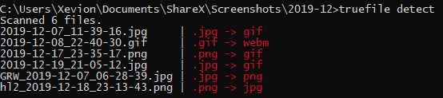

# true-filetype

## Purpose

I've been noticing in my hoarding of media that a large number of images seem to be the incorrect file type. Image readers have no trouble reading the correct image as they check the data before the filetype, but IrfanView enjoys pestering me, telling me they have incorrect image types. So, I decided to sit down at 4AM in the morning to create a utility using one of the thousand Pypi applications.

It's a little buggy and seems to be detecting incorrectly, as I'll show below.

However, I'm not really intending this to be a big project, just a proof of concept idea that I can work on later should I want to continue it.

If you'd like to improve my code, feel free to send in a PR or Issue with appropriate details. Thanks.

## Demonstration

Currently the only command is [`truefile detect`](https://github.com/Xevion/truefile/blob/cde1590a2a3e9340c35015526e6119323e96a8dc/truefile/cli.py#L24). I hope to add in a couple more commands and arguments that will better suite the end user (me).

